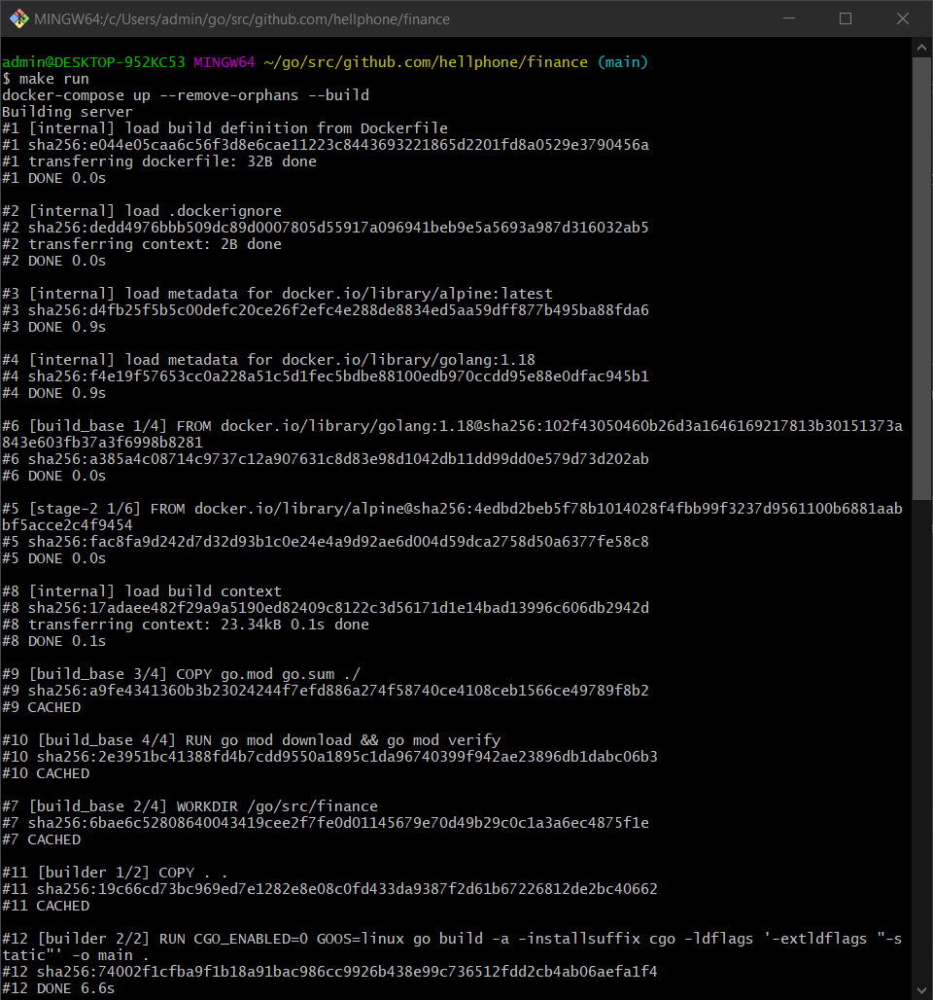
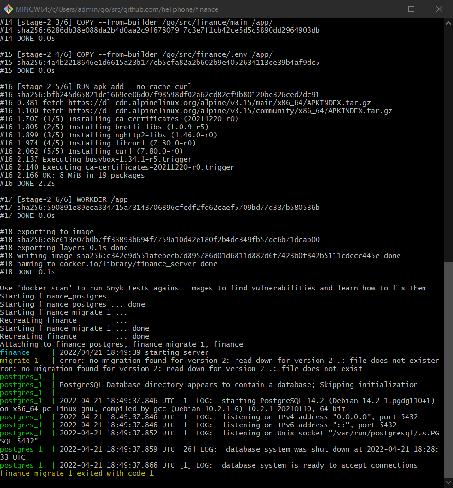

# Finance


## Task description
Нужно написать веб-сервер с двумя обработчиками.
Первый обработчик пополняет баланс указанного пользователя на указанную сумму, то есть получает на вход 2 значения.

Второй переводит указанную сумму со счета первого пользователя на счет другого. В минус уходить нельзя. Принимает на вход 3 значения:
1. ID пользователя (или баланса), с которого происходит списание;
2. ID пользователя, которому на счет поступают средства;
3. Сумма средств для перевода.

В проекте нужна миграция для создания таблицы. Если получится, то можно написать тесты.
Предусмотреть остановку веб-сервера без потери обрабатываемых запросов.

Использовать СУБД PostgreSQL.

## Launch
To run this project, just run the following command:

`make run`

## API examples
### add_money_to_user
Request:
```
POST localhost:1234/api/v1/add_money_to_user

{
  "user_id": 1,
  "money_amount": 1000
}
```

Response:
```
200 OK
{
  "data": {
    "id": 1,
    "name": "George",
    "money_amount": 26000
  }
}
```

### transfer_money
Request:
```
POST localhost:1234/api/v1/transfer_money

{
  "user_from_id": 1,
  "user_to_id": 2,
  "money_amount": 500
}
```

Response:
```
200 OK
{
  "data": [
    {
      "id": 2,
      "name": "Kate",
      "money_amount": 23500
    },
    {
      "id": 1,
      "name": "George",
      "money_amount": 24500
    }
  ]
}
```

## In action



